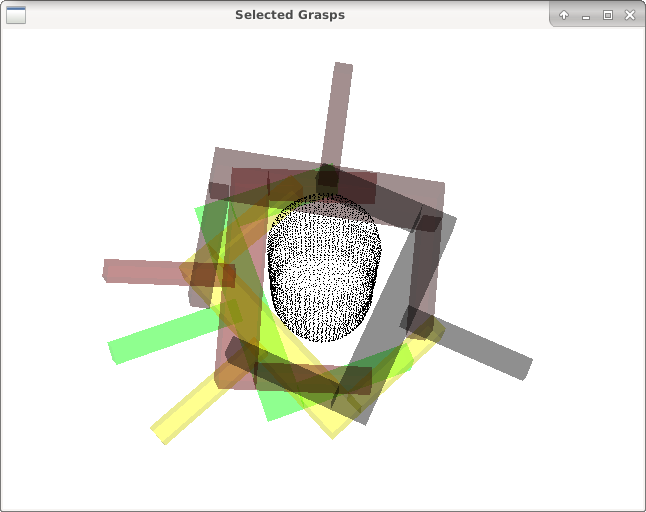

# Grasp Pose Detection (GPD)

* **Author:** Andreas ten Pas (atp@ccs.neu.edu)
* **Version:** 1.0.0
* **Author's website:** [http://www.ccs.neu.edu/home/atp/](http://www.ccs.neu.edu/home/atp/)
* **License:** BSD


## 1) Overview

This package detects 6-DOF grasp poses for a 2-finger grasp (e.g. a parallel jaw gripper) in 3D point clouds.

<!--  -->

Grasp pose detection consists of three steps: sampling a large number of grasp candidates, classifying these candidates 
as viable grasps or not, and clustering viable grasps which are geometrically similar.

The reference for this package is: [High precision grasp pose detection in dense clutter](http://arxiv.org/abs/1603.01564).

### UR5 Demo

<a href="http://www.youtube.com/watch?feature=player_embedded&v=y7z-Yn1PQNI
" target="_blank"></a>


## 2) Requirements

1. [PCL 1.7 or later](http://pointclouds.org/)
2. [Eigen 3.0 or later](https://eigen.tuxfamily.org)
3. [ROS Indigo](http://wiki.ros.org/indigo)
4. [Caffe](http://caffe.berkeleyvision.org/)


## 3) Prerequisites

The following instructions have been tested on **Ubuntu 14.04**. Similar instructions should work for other Linux 
distributions that support ROS.

1. Install Caffe [(Instructions)](http://caffe.berkeleyvision.org/installation.html). Follow the *CMake Build* 
instructions. **Notice:** Due to a conflict between the Boost version required by Caffe (1.55) and the one installed as 
a dependency with the Debian package for ROS Indigo (1.54), you need to checkout an older version of Caffe that worked 
with Boost 1.54. So, when you clone Caffe, please use the command below instead.

   ```
   git clone https://github.com/BVLC/caffe.git && cd caffe && git checkout 923e7e8b6337f610115ae28859408bc392d13136
   ```

2. Install ROS Indigo [(Instructions)](http://wiki.ros.org/indigo/Installation/Ubuntu).

3. Clone the [grasp_pose_generator](https://github.com/atenpas/gpg) repository into some folder:

   ```
   $ cd <location_of_your_workspace>
   $ git clone https://github.com/atenpas/gpg.git
   ```

4. Build and install the *grasp_pose_generator*: 

   ```
   $ cd gpg
   $ mkdir build && cd build
   $ cmake ..
   $ make
   $ sudo make install
   ```


## 4) Compilation

1. Clone this repository.
   
   ```
   $ cd <location_of_your_workspace/src>
   $ git clone https://github.com/atenpas/gpd.git
   ```

2. Build your catkin workspace.

   ```
   $ cd <location_of_your_workspace>
   $ catkin_make
   ```


## 5) Generate Grasps for a Point Cloud File

Launch the grasp pose detection on an example point cloud:
   
   ```
   roslaunch gpd tutorial0.launch
   ```
Within the GUI that appears, press r to center the view, and q to quit the GUI and load the next visualization.
The output should look similar to the screenshot shown below.




## 6) Tutorials

1. [Detect Grasps With an RGBD camera](tutorials/tutorial_1_grasps_camera.md)
2. [Detect Grasps on a Specific Object](tutorials/tutorial_2_grasp_select.md)


## 7) Parameters

Brief explanations of parameters are given in *launch/classify_candidates_file_15_channels.launch* for using PCD files. 
For use on a robot, see *launch/ur5_15_channels.launch*.


## 8) Citation

If you like this package and use it in your own work, please cite our paper:

[1] Marcus Gualtieri, Andreas ten Pas, Kate Saenko, Robert Platt. [**High precision grasp pose detection in dense clutter.**](http://arxiv.org/abs/1603.01564) IROS 2016. 598-605.

